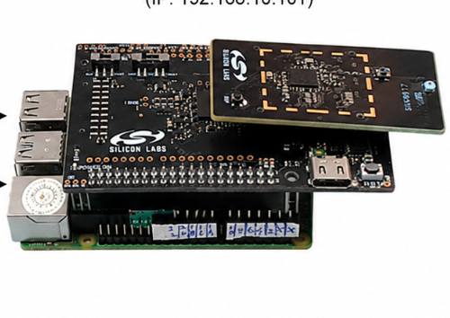
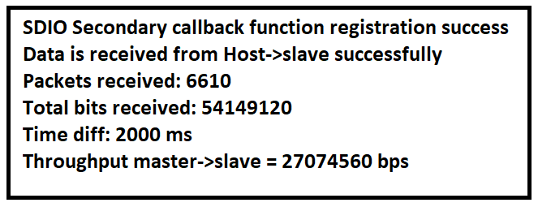

# SiWx91x Platform SDIO Secondary FreeRTOS

## Table of Contents

- [SiWx91x Platform SDIO Secondary FreeRTOS](#siwx91x-platform-sdio-secondary-freertos)
  - [Purpose/Scope](#purposescope)
  - [Overview](#overview)
  - [About Example Code](#about-example-code)
    - [FreeRTOS Architecture](#freertos-architecture)
    - [Raspberry Pi Handshake](#raspberry-pi-handshake)
  - [Prerequisites/Setup Requirements](#prerequisitessetup-requirements)
    - [Hardware Requirements](#hardware-requirements)
    - [Software Requirements](#software-requirements)
    - [Setup Diagram](#setup-diagram)
  - [Getting Started](#getting-started)
  - [Application Build Environment](#application-build-environment)
    - [Pin Configuration](#pin-configuration)
  - [Test the Application](#test-the-application)
    - [Expected Output](#expected-output)
  - [Troubleshooting](#troubleshooting)
  - [Resources](#resources)
  - [Report Bugs / Support](#report-bugs--support)

## Purpose/Scope

The SDIO Secondary application shows how to read and write data in SDIO Secondary, running as a dedicated FreeRTOS task using CMSIS-RTOS2 APIs.
This application also provides a configuration option to establish SDIO communication between a Raspberry Pi (host/master) and the SiWx917 SoC (secondary).

## Overview

- This example uses the SDIO Secondary device role on the SiWx91x SoC with the WiSeConnect driver and CMSIS-RTOS2.
- A dedicated FreeRTOS task runs the SDIO state machine, handles DMA-backed send and receive, and prints periodic throughput on the console.
- Callback registration, transfer APIs, and task lifecycle are described under [About Example Code](#about-example-code).
- When `SL_SIWX91X_RASPBERRY_PI_HANDSHAKE_ENABLE` is set to `1`, the example runs a GPIO handshake with the Raspberry Pi before starting SDIO data transfer. The default value is `0` so generic SDIO hosts (DATA/CLK/CMD only) skip the handshake. Enabling the flag also requires installing the GPIO component (`sl_gpio`).

## About Example Code

The source file for this example is `sdio_secondary_mode_freertos.c`.

This example demonstrates SDIO secondary data transfer (send/receive) with an external SDIO host/master, running inside a dedicated FreeRTOS task.

- To register SDIO and DMA callbacks using [sl_si91x_sdio_secondary_register_event_callback](https://docs.silabs.com/wiseconnect/latest/wiseconnect-api-reference-guide-si91x-peripherals/sdio#sl-si91x-sdio-secondary-register-event-callback) and `sl_si91x_sdio_secondary_gpdma_register_event_callback` APIs.
- To transfer and receive data to and from the master using the [sl_si91x_sdio_secondary_send](https://docs.silabs.com/wiseconnect/latest/wiseconnect-api-reference-guide-si91x-peripherals/sdio#sl-si91x-sdio-secondary-send) and [sl_si91x_sdio_secondary_receive](https://docs.silabs.com/wiseconnect/latest/wiseconnect-api-reference-guide-si91x-peripherals/sdio#sl-si91x-sdio-secondary-receive) APIs. Send and receive APIs configure all DMA descriptors and trigger the DMA to send and receive the data.
- Inside the task's `while (1)` loop, it runs a state machine that handles `RECEIVE_DATA` or `SEND_DATA` modes. Data is received/sent continuously, and after every two seconds throughput is calculated and printed over the console.
- If callback registration fails, the task prints an error via `SL_PRINT_STRING_ERROR` and calls `osThreadExit()` to terminate.
- When the state machine reaches `TRANSMISSION_COMPLETED`, the task calls `osThreadExit()` to cleanly terminate.

### FreeRTOS Architecture

- On startup, `main.c` calls `sl_main_second_stage_init()` to initialize all SDK components, then calls `app_init()` which invokes `sdio_secondary_mode_example_init()`. This function creates the `sdio_task` FreeRTOS thread using `osThreadNew()`.
- The `app_process_action()` function is a no-op since all application logic runs inside the dedicated task.
- The `main.c` flow calls `app_init()` followed by a `while (sl_main_start_task_should_continue())` loop that calls `app_process_action()` (no-op). The FreeRTOS scheduler manages task execution.

### Raspberry Pi Handshake

When `SL_SIWX91X_RASPBERRY_PI_HANDSHAKE_ENABLE` is set to `1` in `sdio_secondary_mode_freertos.h`, the FreeRTOS task calls `sdio_host_handshake()` after SDIO callback registration and before the send/receive state machine.

This handshake is supported only for the SiWx917 SoC IC mounted on the BRD8045 carrier board and stacked on a Raspberry Pi host, as shown below. Other SiWx917 kits (for example, Wireless Pro Kit plus radio board) are not a supported hardware configuration for this handshake.



The default example project does not include the GPIO component. Before setting the flag to `1`, install the GPIO component (`sl_gpio`) from Software Components in Simplicity Studio, then rebuild. Leaving the flag at `0` does not require GPIO.

Handshake sequence:

1. Initialize GPIO and configure:
   - **UULP_VBAT_GPIO_0** as output (`device_ready`)
   - **UULP_VBAT_GPIO_2** as input (`host_ack`)
2. Optionally set selected unused ULP pins to input mode via `set_soc_gpio_input_mode()` (VCOM UART pins ULP_GPIO_9 / ULP_GPIO_11 are left unchanged so console logging continues to work).
3. Drive `device_ready` low, wait 1 second (`SLI_DEVICE_READY_HOLD_MS`), then drive it high to signal that the SiWx917 is ready.
4. Poll `host_ack` until it remains high across two samples 500 ms apart (`SLI_HANDSHAKE_DEBOUNCE_MS`), indicating Raspberry Pi acknowledgment, or until 30 s (`SLI_HANDSHAKE_TIMEOUT_MS`). On timeout, `device_ready` is driven low before the task exits.
5. On success, print `handshake completed successfully` and continue into the SDIO transfer loop.

> **Note:** The Raspberry Pi should drive host-ack low first, wait for device-ready high (stable > 500 ms), then drive host-ack high. On BRD4338A + WPK (BRD4002A), UULP_VBAT_GPIO_0 is shared with `DISP_ENABLE` (breakout **P14**), and UULP_VBAT_GPIO_2 is shared with **BTN0** (breakout **F12**). Avoid pressing BTN0 during handshake if that net is used for host acknowledge.

## Prerequisites/Setup Requirements

### Hardware Requirements

- Windows PC
- Silicon Labs SiWx917 Evaluation Kit [[BRD4002](https://www.silabs.com/development-tools/wireless/wireless-pro-kit-mainboard?tab=overview) + [BRD4338A](https://www.silabs.com/development-tools/wireless/wi-fi/siwx917-rb4338a-wifi-6-bluetooth-le-soc-radio-board?tab=overview) / [BRD4342A](https://www.silabs.com/development-tools/wireless/wi-fi/siwx91x-rb4342a-wifi-6-bluetooth-le-soc-radio-board?tab=overview) / [BRD4343A](https://www.silabs.com/development-tools/wireless/wi-fi/siw917y-rb4343a-wi-fi-6-bluetooth-le-8mb-flash-radio-board-for-module?tab=overview) / [BRD4343C](https://www.silabs.com/development-tools/wireless/wi-fi/siw917y-rb4343c-wi-fi-6-bluetooth-le-8mb-flash-radio-board-for-module?tab=overview)]
- An external SDIO host/master device (for example, Raspberry Pi when `SL_SIWX91X_RASPBERRY_PI_HANDSHAKE_ENABLE` is set to '1')

### Software Requirements

- Simplicity Studio
- Serial console setup
  - For serial console setup instructions, see the [Console Input and Output](https://docs.silabs.com/wiseconnect/latest/wiseconnect-developers-guide-developing-for-silabs-hosts/using-the-simplicity-studio-ide#console-input-and-output) section in the *WiSeConnect Developer's Guide*.

### Setup Diagram


## Getting Started

Refer to the instructions [here](https://docs.silabs.com/wiseconnect/latest/wiseconnect-getting-started/) to:

- [Install Simplicity Studio](https://docs.silabs.com/wiseconnect/latest/wiseconnect-developers-guide-developing-for-silabs-hosts/using-the-simplicity-studio-ide#install-simplicity-studio)
- [Install WiSeConnect extension](https://docs.silabs.com/wiseconnect/latest/wiseconnect-developers-guide-developing-for-silabs-hosts/using-the-simplicity-studio-ide#install-the-wiseconnect-3-extension)
- [Connect your device to the computer](https://docs.silabs.com/wiseconnect/latest/wiseconnect-developers-guide-developing-for-silabs-hosts/using-the-simplicity-studio-ide#connect-siwx91x-to-computer)
- [Upgrade your connectivity firmware](https://docs.silabs.com/wiseconnect/latest/wiseconnect-developers-guide-developing-for-silabs-hosts/using-the-simplicity-studio-ide#update-siwx91x-connectivity-firmware)
- [Create a Studio project](https://docs.silabs.com/wiseconnect/latest/wiseconnect-developers-guide-developing-for-silabs-hosts/using-the-simplicity-studio-ide#create-a-project)

For details on the project folder structure, see the [WiSeConnect Examples](https://docs.silabs.com/wiseconnect/latest/wiseconnect-examples/#example-folder-structure) page.

## Application Build Environment

- Configure UC from the slcp component.

  >

- Enable Raspberry Pi handshake:
  1. In Simplicity Studio, install the GPIO component (`sl_gpio`) (SOFTWARE COMPONENTS → Device → Si91x → MCU → Peripheral → GPIO).
  2. Set `SL_SIWX91X_RASPBERRY_PI_HANDSHAKE_ENABLE` to `1` in `sdio_secondary_mode_freertos.h` (default is `0` for generic SDIO hosts).

  ```c
  #define SL_SIWX91X_RASPBERRY_PI_HANDSHAKE_ENABLE 1
  ```

- Modify `current_mode` in the `sdio_secondary_mode_freertos.c` file to configure the mode for SDIO Secondary.
  By default current mode is in RECEIVE_DATA.

  ```c
  /* Mode of Transmission */
  SEND_DATA    /* Transmit data to the master  */
  RECEIVE_DATA /* Receive data from the master */

  /* Modify this macro to change mode of transmission for sdio secondary */
  current_mode = RECEIVE_DATA /* Default is receive mode, i.e., RX_PATH */
  ```

- Modify BLOCK_LEN and NO_OF_BLOCKS in the `sdio_secondary_mode_freertos.c` file to configure size for application buffer:

  - `BLOCK_LEN`: Length of a single SDIO block (in bytes) used for data transfer between master and secondary. By default, it is set to 256.

    ```c
    #define BLOCK_LEN         256
    ```

  - `NO_OF_BLOCKS`: Number of blocks transferred per SDIO operation. By default, it is set to 4.

    ```c
    #define NO_OF_BLOCKS      4
    ```

  - `XFER_BUFFER_SIZE`: Total size (in bytes) of the SDIO transfer buffer (`xfer_buffer`) used for send and receive operations. It is derived from `BLOCK_LEN * NO_OF_BLOCKS`; with the default values (256 * 4), the buffer size is 1 KB. Update `BLOCK_LEN` and/or `NO_OF_BLOCKS` to change it.

    ```c
    #define XFER_BUFFER_SIZE  (BLOCK_LEN * NO_OF_BLOCKS) /* Buffer size is 256B*4 = 1KB */
    ```

### Pin Configuration

SDIO interface pins (BRD4338A + WPK breakout pads):

| GPIO pin | Connection | Description |
|----------|------------|-------------|
| GPIO_25  | P25        | SDIO_CLK    |
| GPIO_26  | P27        | SDIO_CMD    |
| GPIO_27  | P29        | SDIO_DATA0  |
| GPIO_28  | P31        | SDIO_DATA1  |
| GPIO_29  | P33        | SDIO_DATA2  |
| GPIO_30  | P35        | SDIO_DATA3  |

Raspberry Pi handshake pins (when `SL_SIWX91X_RASPBERRY_PI_HANDSHAKE_ENABLE` is `1`, BRD4338A + WPK):

| GPIO pin           | Connection | Direction | Description                                      |
|--------------------|------------|-----------|--------------------------------------------------|
| UULP_VBAT_GPIO_0   | P14        | Output    | Device ready (SiWx917 -> host)                   |
| UULP_VBAT_GPIO_2   | F12        | Input     | Host acknowledge (host -> SiWx917); also BTN0    |

NOTE: Connect secondary DATA*, CLK, and CMD pins to the corresponding master pins. Also connect common GND.

> **Note**: For recommended settings, please refer the [recommendations guide](https://docs.silabs.com/wiseconnect/latest/wiseconnect-developers-guide-prog-recommended-settings/).

## Test the Application

1. Connect secondary DATA*, CLK, and CMD pins to master DATA*, CLK, and CMD pins properly. Connect GND.
2. If using Raspberry Pi mode (`SL_SIWX91X_RASPBERRY_PI_HANDSHAKE_ENABLE` set to `1`):
   - Connect SiWx917 **P14** (device ready) to the Raspberry Pi GPIO used for ready detect.
   - Connect SiWx917 **F12** (host ack) to the Raspberry Pi GPIO used for acknowledge.
   - On the Raspberry Pi, drive host-ack low first, wait for device-ready high (stable > 500 ms), then drive host-ack high.
3. When the application runs, the FreeRTOS task initializes the SDIO secondary, completes handshake (if enabled), and begins the data transfer state machine.
4. In RECEIVE_DATA mode, the secondary receives data from the master and prints throughput every 2 seconds.
5. In SEND_DATA mode, the secondary transmits data to the master and prints throughput every 2 seconds.

NOTE:

- TX_PATH (Transmit data from SDIO secondary to SDIO master): SDIO secondary transmits data from `xfer_buffer`.
- RX_PATH (Receive data from SDIO master to SDIO secondary): SDIO secondary receives data in `xfer_buffer`.

### Expected Output

After successful program execution, the prints in serial console look as shown below.

With Raspberry Pi handshake enabled, expect messages such as:

```text
SDIO Secondary callback function registration success
SL917 SDIO CONFIGURATION COMPLETED
SL917 GPIO0 HIGH: Waiting for SDIO handshake from host
Waiting for handshake from Raspberry pi...
handshake completed successfully
```

Then the normal transfer/throughput prints follow.

>

> **Note:**
>
> - Interrupt handlers are implemented in the driver layer, and user callbacks are provided for custom code. If you want to write your own interrupt handler instead of using the default one, make the driver interrupt handler a weak handler. Then, copy the necessary code from the driver handler to your custom interrupt handler.
> - In case of sleep-wakeup, call `sl_si91x_sdio_secondary_init()` after wakeup before restarting SDIO transfers so the SDIO secondary peripheral state is restored.

## Troubleshooting

- If the project does not build after enabling handshake, install the GPIO component (`sl_gpio`) and confirm `SL_SIWX91X_RASPBERRY_PI_HANDSHAKE_ENABLE` is `1`. If the project does not build with the flag at `0`, ensure Simplicity Studio and the WiSeConnect extension are installed and the board is connected.
- If the device is not detected, reinstall the connectivity firmware and check USB drivers.
- If handshake times out (~30 s), verify P14/F12 wiring, common GND, and that the Raspberry Pi drives host-ack high after first driving it low. Remember F12 is shared with BTN0. Also confirm `SL_SIWX91X_RASPBERRY_PI_HANDSHAKE_ENABLE` is `1` only when those GPIOs are connected.
- If console output stops after enabling unused-pin input configuration, do not reconfigure ULP_GPIO_9 / ULP_GPIO_11 (VCOM UART).

## Resources

- [WiSeConnect Getting Started](https://docs.silabs.com/wiseconnect/latest/wiseconnect-getting-started/)
- [WiSeConnect Examples](https://docs.silabs.com/wiseconnect/latest/wiseconnect-examples/)
- [Si91x SoC Documentation](https://docs.silabs.com/wiseconnect/latest/)
- [UG562: BRD4338A User Guide](https://www.silabs.com/documents/public/user-guides/ug562-brd4338a-user-guide.pdf)

## Report Bugs / Support

For issues and support, use the Silicon Labs Community or your normal support channel.
