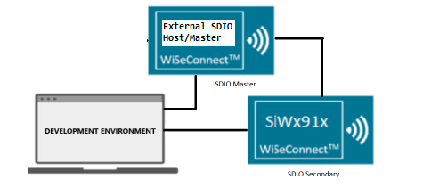
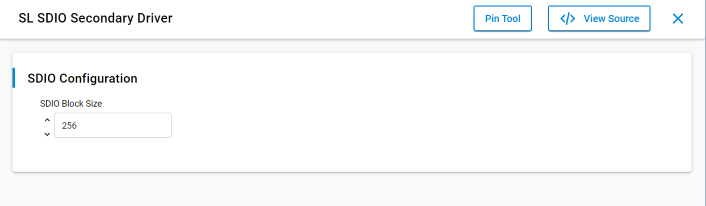
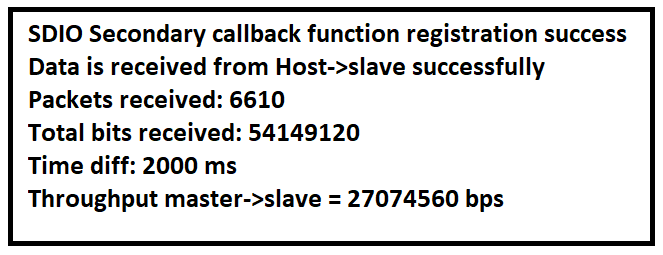

# SiWx91x Platform SDIO Secondary FreeRTOS

## Table of Contents

- [SiWx91x Platform SDIO Secondary FreeRTOS](#platform-siwx91x-sdio-secondary-freertos)
  - [Purpose/Scope](#purposescope)
  - [Overview](#overview)
  - [About Example Code](#about-example-code)
    - [FreeRTOS Architecture](#freertos-architecture)
  - [Prerequisites/Setup Requirements](#prerequisitessetup-requirements)
    - [Hardware Requirements](#hardware-requirements)
    - [Software Requirements](#software-requirements)
    - [Setup Diagram](#setup-diagram)
  - [Getting Started](#getting-started)
  - [Application Build Environment](#application-build-environment)
    - [Pin Configuration](#pin-configuration)
  - [Test the Application](#test-the-application)
    - [Expected Output](#expected-output)


## Purpose/Scope

The SDIO Secondary application shows how to read and write data in SDIO Secondary, running as a dedicated FreeRTOS task using CMSIS-RTOS2 APIs.

## Overview

- The SiWx91x device operates in the SDIO Secondary role and communicates with an external SDIO host.
- A dedicated `sdio_task` initializes the peripheral, configures callbacks, manages the selected transfer mode, and waits on DMA completion events.
- A lower-priority `sdio_stats` task reports host-to-secondary receive statistics without delaying the receive path.
- Host-to-secondary reception uses an explicitly configured transfer length through `sl_si91x_sdio_secondary_receive_with_length()`.
- Two aligned receive buffers are used in ping-pong order. The alternate buffer is armed from the GPDMA completion callback to minimize the interval in which no receive descriptor is active.
- The SDIO CMD53 write interrupt is unmasked only after the receive DMA descriptor chain has been armed.
- CRC, abort, timeout, and GPDMA errors are captured and reported through the application error-handling path.
- An optional four-byte frame header allows the payload length to vary while the frame size on the SDIO bus remains fixed.
- Callback registration, transfer APIs, and task lifecycle are described under [About Example Code](#about-example-code).


## About Example Code

The source file for this example is `sdio_secondary_mode_freertos.c`.

This example demonstrates SDIO secondary data transfer (send/receive) with an external SDIO host/master, running inside a dedicated FreeRTOS task.

- To register SDIO and DMA callbacks using [sl_si91x_sdio_secondary_register_event_callback](https://docs.silabs.com/wiseconnect/latest/wiseconnect-api-reference-guide-si91x-peripherals/sdio#sl-si91x-sdio-secondary-register-event-callback) and `sl_si91x_sdio_secondary_gpdma_register_event_callback` APIs.
- To transfer and receive data to and from the master using the [sl_si91x_sdio_secondary_send](https://docs.silabs.com/wiseconnect/latest/wiseconnect-api-reference-guide-si91x-peripherals/sdio#sl-si91x-sdio-secondary-send) and [sl_si91x_sdio_secondary_receive_with_length](https://docs.silabs.com/wiseconnect/latest/wiseconnect-api-reference-guide-si91x-peripherals/sdio#sl-si91x-sdio-secondary-receive) APIs. Send and receive APIs will configure all DMA descriptors and trigger the DMA to send and receive the data.
- Inside the task's `while (1)` loop, it runs a state machine that handles `RECEIVE_DATA` or `SEND_DATA` modes. Data is received/sent continuously, and after every two seconds throughput is calculated and printed over the console.
- In `RECEIVE_DATA` mode, two aligned receive buffers are used in ping-pong order. After a GPDMA transfer completes, the alternate buffer is armed from the GPDMA callback while the completed buffer is processed by the SDIO task.
- A separate lower-priority statistics task prints receive throughput, payload statistics, error counters, and the contents of the most recently completed receive buffer.
- When a CRC, host abort, read-FIFO timeout, or GPDMA error occurs, the application records the error, releases the waiting task, drains any remaining receive FIFO data, and re-arms the receive path.
- For continuous back-to-back transfers, `RX_BUFFER_COUNT` can be increased to provide additional receive buffers. A custom FIFO, ring buffer, or message queue must also store each completed buffer index so the receive task processes the buffers in the correct order. Increasing `RX_BUFFER_COUNT` alone does not prevent frame loss because a single `rx_filled_index` can be overwritten by consecutive DMA completions.
- For both host-to-secondary reception and secondary-to-host transmission, the total transfer size, calculated as `BLOCK_LEN × NO_OF_BLOCKS`, must not exceed 2048 bytes.
- If callback registration fails, the task prints an error via `DEBUGOUT` and calls `osThreadExit()` to terminate.
- When the state machine reaches `TRANSMISSION_COMPLETED`, the task calls `osThreadExit()` to cleanly terminate.


### FreeRTOS Architecture

- On startup, `main.c` calls `sl_main_second_stage_init()` to initialize all SDK components, then calls `app_init()` which invokes `sdio_secondary_mode_example_init()`. This function creates the `sdio_task` and `sdio_stats` FreeRTOS thread using `osThreadNew()`.
- The `app_process_action()` function is a no-op since all application logic runs inside the dedicated task.
- The `main.c` flow calls `app_init()` followed by a `while (sl_main_start_task_should_continue())` loop that calls `app_process_action()` (no-op). The FreeRTOS scheduler manages task execution.


## Prerequisites/Setup Requirements


### Hardware Requirements

- Windows PC
- Silicon Labs SiWx917 Evaluation Kit [[BRD4002](https://www.silabs.com/development-tools/wireless/wireless-pro-kit-mainboard?tab=overview) + [BRD4338A](https://www.silabs.com/development-tools/wireless/wi-fi/siwx917-rb4338a-wifi-6-bluetooth-le-soc-radio-board?tab=overview) / [BRD4342A](https://www.silabs.com/development-tools/wireless/wi-fi/siwx91x-rb4342a-wifi-6-bluetooth-le-soc-radio-board?tab=overview) / [BRD4343A](https://www.silabs.com/development-tools/wireless/wi-fi/siw917y-rb4343a-wi-fi-6-bluetooth-le-8mb-flash-radio-board-for-module?tab=overview) / [BRD4343C](https://www.silabs.com/development-tools/wireless/wi-fi/siw917y-rb4343c-wi-fi-6-bluetooth-le-8mb-flash-radio-board-for-module?tab=overview)]
- An external SDIO host/master device.


### Software Requirements

- Simplicity Studio
- Serial console setup
  - For serial console setup instructions, see the [Console Input and Output](https://docs.silabs.com/wiseconnect/latest/wiseconnect-developers-guide-developing-for-silabs-hosts/using-the-simplicity-studio-ide#console-input-and-output) section in the *WiSeConnect Developer's Guide*.


### Setup Diagram



## Getting Started

Refer to the instructions [here](https://docs.silabs.com/wiseconnect/latest/wiseconnect-getting-started/) to:

- [Install Simplicity Studio](https://docs.silabs.com/wiseconnect/latest/wiseconnect-developers-guide-developing-for-silabs-hosts/using-the-simplicity-studio-ide#install-simplicity-studio)
- [Install WiSeConnect extension](https://docs.silabs.com/wiseconnect/latest/wiseconnect-developers-guide-developing-for-silabs-hosts/using-the-simplicity-studio-ide#install-the-wiseconnect-3-extension)
- [Connect your device to the computer](https://docs.silabs.com/wiseconnect/latest/wiseconnect-developers-guide-developing-for-silabs-hosts/using-the-simplicity-studio-ide#connect-siwx91x-to-computer)
- [Upgrade your connectivity firmware](https://docs.silabs.com/wiseconnect/latest/wiseconnect-developers-guide-developing-for-silabs-hosts/using-the-simplicity-studio-ide#update-siwx91x-connectivity-firmware)
- [Create a Studio project](https://docs.silabs.com/wiseconnect/latest/wiseconnect-developers-guide-developing-for-silabs-hosts/using-the-simplicity-studio-ide#create-a-project)

For details on the project folder structure, see the [WiSeConnect Examples](https://docs.silabs.com/wiseconnect/latest/wiseconnect-examples/#example-folder-structure) page.

## Application Build Environment

- Configure UC from the slcp component.
  > 
- Modify `current_mode` in the `sdio_secondary_mode_freertos.c` file to configure the mode for SDIO Secondary.
By default current mode is in RECEIVE_DATA.
  ```c
  /* Mode of Transmission */
  SEND_DATA    /* Transmit data to the master  */
  RECEIVE_DATA /* Receive data from the master */

  /* Modify this macro to change mode of transmission for sdio secondary */
  current_mode = RECEIVE_DATA /* Default is receive mode, i.e., RX_PATH */
  ```
- Modify BLOCK_LEN and NO_OF_BLOCKS in the `sdio_secondary_mode_freertos.c` file to configure size for application buffer:
  - `BLOCK_LEN`: Length of a single SDIO block (in bytes) used for data transfer between master and secondary. By default, it is set to 256.
    ```c
    #define BLOCK_LEN         256
    ```
  - `NO_OF_BLOCKS`: Number of blocks transferred per SDIO operation. By default, it is set to 4.
    ```c
    #define NO_OF_BLOCKS      4
    ```
  - `XFER_BUFFER_SIZE`: Total size (in bytes) of the SDIO transfer buffer (`xfer_buffer`) used for send and receive operations. It is derived from `BLOCK_LEN * NO_OF_BLOCKS`; with the default values (256 * 4), the buffer size is 1 KB. Update `BLOCK_LEN` and/or `NO_OF_BLOCKS` to change it.
    ```c
    #define XFER_BUFFER_SIZE  (BLOCK_LEN * NO_OF_BLOCKS) /* Buffer size is 256B*4 = 1KB */
    ```


### Pin Configuration


| GPIO pin | Connection | Description |
| -------- | ---------- | ----------- |
| GPIO_25  | P25        | SDIO_CLK    |
| GPIO_26  | P27        | SDIO_CMD    |
| GPIO_27  | P29        | SDIO_DATA0  |
| GPIO_28  | P31        | SDIO_DATA1  |
| GPIO_29  | P33        | SDIO_DATA2  |
| GPIO_30  | P35        | SDIO_DATA3  |


NOTE: Pin configuration for SDIO Master.

> **Note**: For recommended settings, please refer the [recommendations guide](https://docs.silabs.com/wiseconnect/latest/wiseconnect-developers-guide-prog-recommended-settings/).


## Test the Application

1. Connect secondary DATA*, CLK, CMD pins to Master DATA*, CLK, CMD pins properly.
2. When the application runs, the FreeRTOS task initializes the SDIO secondary and begins the data transfer state machine.
3. In RECEIVE_DATA mode, the secondary receives data from the master and prints throughput every 2 seconds.
4. In SEND_DATA mode, the secondary transmits data to the master and prints throughput every 2 seconds.

NOTE:

- TX_PATH (Transmit data from SDIO secondary to SDIO master): SDIO secondary transmits data from `xfer_buffer`.
- RX_PATH (Receive data from SDIO master to SDIO secondary): SDIO secondary receives data in `xfer_buffer`.


### Expected Output

After successful program execution, the prints in serial console looks as shown below.

> 

> **Note:**
>
> - Interrupt handlers are implemented in the driver layer, and user callbacks are provided for custom code. If you want to write your own interrupt handler instead of using the default one, make the driver interrupt handler a weak handler. Then, copy the necessary code from the driver handler to your custom interrupt handler.
> - In case of sleep-wakeup, call `sl_si91x_sdio_secondary_init()` after wakeup before restarting SDIO transfers so the SDIO secondary peripheral state is restored.


## Troubleshooting

- If the project does not build, ensure Simplicity Studio and the WiSeConnect extension are installed and the board is connected.
- If the device is not detected, reinstall the connectivity firmware and check USB drivers.


## Resources

- [WiSeConnect Getting Started](https://docs.silabs.com/wiseconnect/latest/wiseconnect-getting-started/)
- [WiSeConnect Examples](https://docs.silabs.com/wiseconnect/latest/wiseconnect-examples/)
- [Si91x SoC Documentation](https://docs.silabs.com/wiseconnect/latest/)


## Report Bugs / Support

For issues and support, use the Silicon Labs Community or your normal support channel.
