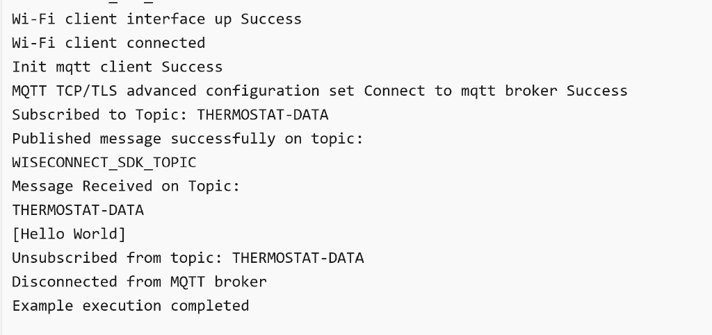
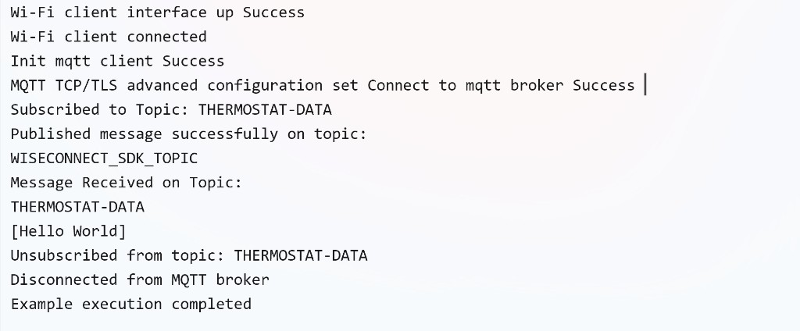
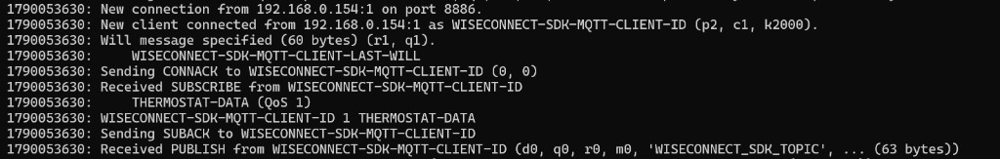
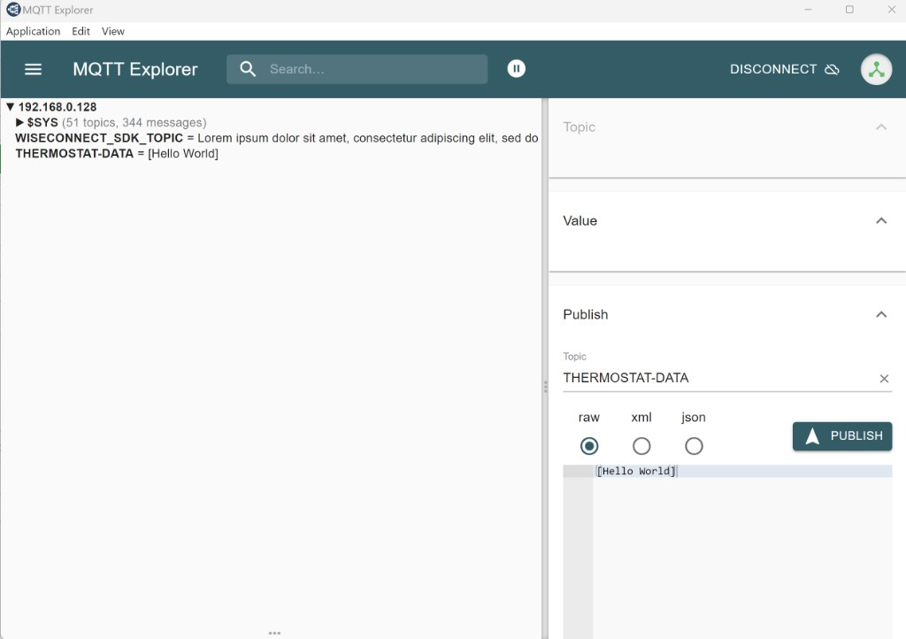
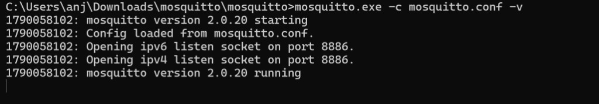
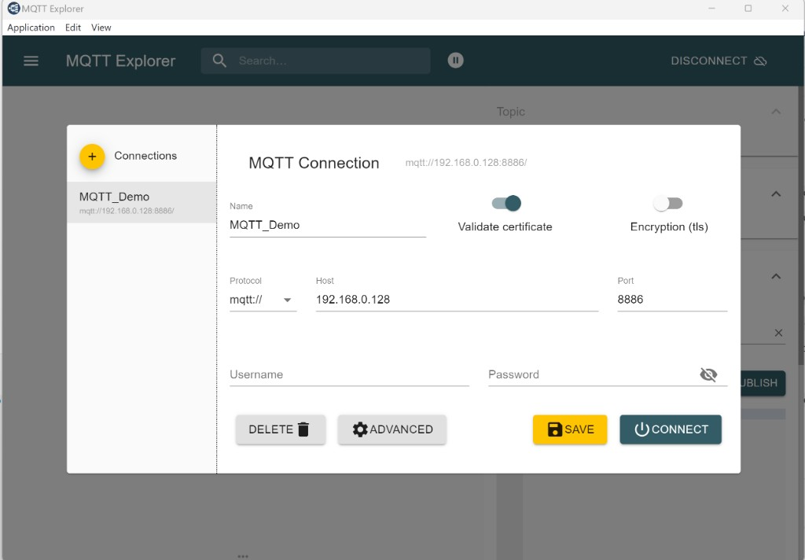

# Wi-Fi - Embedded MQTT Client

## High-Level Overview

SiWx91x embedded MQTT example: Connect to Wi-Fi and an MQTT broker and subscribe and publish on configured topics using the embedded MQTT client in SoC and NCP modes.

## Table of Contents

- [Wi-Fi - Embedded MQTT Client](#wi-fi---embedded-mqtt-client)
  - [Table of Contents](#table-of-contents)
  - [High-Level Overview](#high-level-overview)
  - [Purpose/Scope](#purposescope)
  - [Prerequisites/Setup Requirements](#prerequisitessetup-requirements)
    - [Hardware Requirements](#hardware-requirements)
    - [Software Requirements](#software-requirements)
    - [Setup Diagram](#setup-diagram)
  - [Getting Started](#getting-started)
  - [Application Build Environment](#application-build-environment)
  - [Test the Application](#test-the-application)
    - [Procedure for executing the application when enabled with SSL](#procedure-for-executing-the-application-when-enabled-with-ssl)
  - [Additional Information](#additional-information)
    - [Steps to set up MQTT server](#steps-to-set-up-mqtt-server)
  - [Troubleshooting](#troubleshooting)
  - [Resources](#resources)
  - [Report Bugs and Get Support](#report-bugs-and-get-support)

## Purpose/Scope

This application demonstrates how SiWx91x is configured as an MQTT client, connects to an MQTT broker, subscribes to a topic, and publishes messages on a particular MQTT topic.
In this application, SiWx91x is configured as a Wi-Fi station and connects to an access point. After successful Wi-Fi connection, the application connects to a MQTT broker and subscribes to the topic **TOPIC_TO_BE_SUBSCRIBED** (**THERMOSTAT-DATA**). Subsequently, the application publishes a message **"Lorem ipsum dolor sit amet, consectetur adipiscing elit, sed do"** on the **PUBLISH_TOPIC** (**WISECONNECT_SDK_TOPIC**). The application then waits indefinitely until another MQTT client publishes on **THERMOSTAT-DATA**. After receiving that message, it unsubscribes and disconnects from the MQTT broker.

### Large Payload Support

The SDK supports receiving large incoming MQTT payloads through fragmentation and reassembly:

- **Transparent to Application**: The SDK automatically reassembles fragmented MQTT messages, so applications receive complete messages in their handler callbacks without requiring any special handling.

**Configuration:**

- SDK default for `SL_MQTT_CLIENT_MAX_RX_PAYLOAD_SIZE` is **8192 bytes**. Set to `0` to disable large payload reassembly.
- This example overrides the value to **5120 bytes (5 KB)** in the project `.slcp` files to demonstrate large payload reception while conserving memory.

> **Note:** The configured value must cover the complete reassembled incoming payload. Exceeding it reports `SL_MQTT_CLIENT_RECEIVE_PAYLOAD_TOO_LARGE`.

```c
// Optional project customization example (not the SDK default or this example's .slcp override)
#define SL_MQTT_CLIENT_MAX_RX_PAYLOAD_SIZE 4096
```

Example of receiving large messages:

```c
void mqtt_client_message_handler(void *client, sl_mqtt_client_message_t *message, void *context)
{
    // message->content contains the complete reassembled payload
    // message->content_length contains the total payload length (can be > 1400 bytes)
    printf("Received %lu bytes on topic: %.*s\r\n", 
           message->content_length, message->topic_length, message->topic);
}
```

**Error Handling:**

The SDK reports errors during large message reception via `SL_MQTT_CLIENT_ERROR_EVENT`. Handle these in your error callback:

- `SL_MQTT_CLIENT_RECEIVE_PAYLOAD_TOO_LARGE` - Payload exceeds `SL_MQTT_CLIENT_MAX_RX_PAYLOAD_SIZE`
- `SL_MQTT_CLIENT_RECEIVE_MEMORY_ALLOCATION_FAILED` - Failed to allocate reassembly buffer
- `SL_MQTT_CLIENT_RECEIVE_DATA_CORRUPTED` - Data corruption detected during reassembly

## Prerequisites/Setup Requirements

### Hardware Requirements  

- Windows PC
- Wireless Access Point
- Windows PC1 (for running MQTT broker)
- Windows PC2 (for running MQTT client utility - MQTT Explorer)
- SoC Mode:
  - BRD4338A [SiWx917-RB4338A](https://www.silabs.com/development-tools/wireless/wi-fi/siwx917-rb4338a-wifi-6-bluetooth-le-soc-radio-board?tab=overview)
  - BRD4342A [SiWx917-RB4342A](https://www.silabs.com/development-tools/wireless/wi-fi/siwx91x-rb4342a-wifi-6-bluetooth-le-soc-radio-board?tab=overview)
  - BRD4339B [SiWx917-RB4339B](https://docs.silabs.com/wiseconnect/latest/wiseconnect-getting-started/getting-started-with-at)
  - BRD4340A [SiWx917-RB4340A](https://docs.silabs.com/wiseconnect/latest/wiseconnect-getting-started/getting-started-with-at)
  - BRD4343A [SiWx917-RB4343A](https://www.silabs.com/development-tools/wireless/wi-fi/siw917y-rb4343a-wi-fi-6-bluetooth-le-8mb-flash-radio-board-for-module?tab=overview)
  - BRD4343C [SiWx917-RB4343C](https://www.silabs.com/development-tools/wireless/wi-fi/siw917y-rb4343c-wi-fi-6-bluetooth-le-8mb-flash-radio-board-for-module?tab=overview)
  - Kits
    - SiWG917 Dev Kit [BRD2605A](https://www.silabs.com/development-tools/wireless/wi-fi/siwx917-dk2605a-wifi-6-bluetooth-le-soc-dev-kit?tab=overview)
    - SiWG917 Dev Kit [BRD2605B](https://www.silabs.com/development-tools/wireless/wi-fi/siwx917-dk2605b-wifi-6-bluetooth-le-soc-dev-kit?tab=overview)
- NCP Mode:
  - [BRD4346A](https://www.silabs.com/development-tools/wireless/wi-fi/siwx917-rb4346a-wifi-6-bluetooth-le-soc-4mb-flash-radio-board?tab=overview) + [BRD8045C](https://www.silabs.com/development-tools/wireless/wi-fi/shield-adapter-board-for-co-processor-radio-boards?tab=overview)
  - [BRD4357A](https://www.silabs.com/development-tools/wireless/wi-fi/siw917y-rb4357a-wi-fi-6-bluetooth-le-4mb-flash-radio-board-for-rcp-and-ncp-modules?tab=overview) + [BRD8045C](https://www.silabs.com/development-tools/wireless/wi-fi/shield-adapter-board-for-co-processor-radio-boards?tab=overview)
  - [BRD4357C](https://www.silabs.com/development-tools/wireless/wi-fi/siw917y-rb4357c-wi-fi-6-bluetooth-le-4mb-flash-radio-board-for-rcp-and-ncp-modules?tab=overview) + [BRD8045C](https://www.silabs.com/development-tools/wireless/wi-fi/shield-adapter-board-for-co-processor-radio-boards?tab=overview)
  - Silicon Labs [BRD4180B](https://www.silabs.com/development-tools/wireless/slwrb4180b-efr32xg21-wireless-gecko-radio-board?tab=overview) 
  - Host MCU Eval Kit. This example has been tested with:
    - Silicon Labs [WSTK + EFR32MG21](https://www.silabs.com/development-tools/wireless/efr32xg21-bluetooth-starter-kit)
   - Interface and Host MCU Supported
      - SPI - EFR32 
      - UART - EFR32

### Software Requirements

- [Simplicity Studio IDE](https://www.silabs.com/developers/simplicity-studio)
- [Eclipse Mosquitto](https://mosquitto.org/download/) (MQTT broker)
- [Mosquitto documentation](https://mosquitto.org/documentation/) (configuration and TLS)
- [MQTT Explorer](http://mqtt-explorer.com/)

### Setup Diagram

  

>**NOTE:**
>
>- The Host MCU platform (EFR32MG21) and the SiWx91x interact with each other through the SPI interface.

## Getting Started

Refer to the instructions [here](https://docs.silabs.com/wiseconnect/latest/wiseconnect-getting-started/) to:

- [Install Simplicity Studio](https://docs.silabs.com/wiseconnect/latest/wiseconnect-developers-guide-developing-for-silabs-hosts/#install-simplicity-studio)
- [Install WiSeConnect extension](https://docs.silabs.com/wiseconnect/latest/wiseconnect-developers-guide-developing-for-silabs-hosts/#install-the-wi-se-connect-extension)
- [Connect your device to the computer](https://docs.silabs.com/wiseconnect/latest/wiseconnect-developers-guide-developing-for-silabs-hosts/#connect-si-wx91x-to-computer)
- [Upgrade your connectivity firmware ](https://docs.silabs.com/wiseconnect/latest/wiseconnect-developers-guide-developing-for-silabs-hosts/#update-si-wx91x-connectivity-firmware)
- [Create a Studio project ](https://docs.silabs.com/wiseconnect/latest/wiseconnect-developers-guide-developing-for-silabs-hosts/#create-a-project)

For details on the project folder structure, see the [WiSeConnect Examples](https://docs.silabs.com/wiseconnect/latest/wiseconnect-examples/#example-folder-structure) page.

## Application Build Environment

The application can be configured to suit your requirements and development environment. Read through the following sections and make any changes needed.

In the Project explorer pane, expand the **config** folder and open the ``sl_net_default_values.h`` file. Configure the following parameters to enable your Silicon Labs Wi-Fi device to connect to your Wi-Fi network:

- STA instance related parameters

	- DEFAULT_WIFI_CLIENT_PROFILE_SSID refers to the name with which the Wi-Fi network shall be advertised. The SiWx91x module is connected to it.
	
	```c
  	#define DEFAULT_WIFI_CLIENT_PROFILE_SSID               "YOUR_AP_SSID"      
  	```

	- DEFAULT_WIFI_CLIENT_CREDENTIAL refers to the secret key if the access point is configured in WPA-PSK/WPA2-PSK security modes.

  	```c 
  	#define DEFAULT_WIFI_CLIENT_CREDENTIAL                 "YOUR_AP_PASSPHRASE" 
  	```
  
	- DEFAULT_WIFI_CLIENT_SECURITY_TYPE refers to the security type if the access point is configured in WPA/WPA2 or mixed security modes.
  	```c
  	#define DEFAULT_WIFI_CLIENT_SECURITY_TYPE              SL_WIFI_WPA2 
  	```

- Other STA instance configurations can be modified if required in `default_wifi_client_profile` configuration structure.

  Configure the following MQTT parameters in `app.c`:

  - MQTT_BROKER_PORT port refers to the port number on which the remote MQTT broker/server is running. Default plain MQTT lab port is **8886**. For TLS, set this to **8883** to match the TLS listener.

   ```c
   #define MQTT_BROKER_PORT                                8886
   ```

  - MQTT_BROKER_HOST refers to the hostname for TLS/SNI connections (used when `ENCRYPT_CONNECTION` is enabled). Must match a name present in the broker server certificate.

   ```c
   #define MQTT_BROKER_HOST "yourmqtthost.com"
   ```
   
   > **Note**: The hostname length must be at least 1 byte and less than or equal to 252 bytes.

  - MQTT_BROKER_IP refers to the remote peer IP address (Windows PC1) on which the MQTT server is running. For IPv6 builds (`SLI_SI91X_ENABLE_IPV6`), set the IPv6 address instead.

   ```c
   #define MQTT_BROKER_IP                         "192.168.0.128"
   ```

  - CLIENT_PORT refers to the MQTT client's local/source port (not the remote broker port).

   ```c
   #define CLIENT_PORT                                1
   ```

  - CLIENT_ID refers to the unique ID with which the MQTT client connects to MQTT broker/server.

   ```c
   #define CLIENT_ID "WISECONNECT-SDK-MQTT-CLIENT-ID"
   ```

  - TOPIC_TO_BE_SUBSCRIBED refers to the topic to which the MQTT client subscribes.

   ```c
   #define TOPIC_TO_BE_SUBSCRIBED "THERMOSTAT-DATA\0"
   ```

  - QOS_OF_SUBSCRIPTION indicates the quality of service level for subscription.

   ```c
   #define QOS_OF_SUBSCRIPTION    SL_MQTT_QOS_LEVEL_1
   ```

  - PUBLISH_TOPIC refers to the topic to which the MQTT client publishes (not the subscription topic).

   ```c
   #define PUBLISH_TOPIC  "WISECONNECT_SDK_TOPIC"
   ```

  - PUBLISH_MESSAGE refers to message that would be published by MQTT client.

   ```c
   #define PUBLISH_MESSAGE    "Lorem ipsum dolor sit amet, consectetur adipiscing elit, sed do"
   ```

  - QOS_OF_PUBLISH_MESSAGE indicates quality of service which MQTT client uses to publish a message.

   ```c
   #define QOS_OF_PUBLISH_MESSAGE 0
   ```

  - IS_DUPLICATE_MESSAGE indicates whether message sent by MQTT client is a duplicated message.

   ```c
   #define IS_DUPLICATE_MESSAGE 0
   ```

  - IS_MESSAGE_RETAINED whether broker needs to retain message published by MQTT client.

   ```c
   #define IS_MESSAGE_RETAINED 0
   ```

  - IS_CLEAN_SESSION indicates whether this connection is a new one or a continuation of last session.

   ```c
   #define IS_CLEAN_SESSION 1
   ```

  - LAST_WILL_TOPIC Topic of last will message.

   ```c
   #define LAST_WILL_TOPIC  "WISECONNECT-SDK-MQTT-CLIENT-LAST-WILL"
   ```

  - LAST_WILL_MESSAGE Message that would be published by broker if MQTT client disconnected abruptly.

   ```c
   #define LAST_WILL_MESSAGE  "WISECONNECT-SDK-MQTT-CLIENT has been disconnect from network"
   ```

  - QOS_OF_LAST_WILL Quality of service for last will message.

   ```c
   #define QOS_OF_LAST_WILL  1
   ```

  - IS_LAST_WILL_RETAINED Whether broker needs to retain last will message of client.

   ```c
   #define IS_LAST_WILL_RETAINED 1
   ```

  - ENCRYPT_CONNECTION Whether the connection between client and broker should be encrypted using SSL/TLS. Default is `0` (plain MQTT). Set to `1` for TLS.

   ```c
   #define ENCRYPT_CONNECTION  0
   ```

  - CERTIFICATE_INDEX Certificate index used when TLS is enabled (source selects certificate index 1 with TLS 1.2 by default).

   ```c
   #define CERTIFICATE_INDEX      1
   ```

  - KEEP_ALIVE_INTERVAL client keep alive period in seconds.

   ```c
   #define KEEP_ALIVE_INTERVAL                       2000
   ```

  - MQTT_CONNECT_TIMEOUT Timeout for broker connection in milliseconds.

   ```c
   #define MQTT_CONNECT_TIMEOUT                      5000
   ```

  - MQTT_KEEPALIVE_RETRIES Number of keep-alive retries.

   ```c
   #define MQTT_KEEPALIVE_RETRIES 0
   ```

  - SEND_CREDENTIALS Whether to send username and password in connect request.

   ```c
   #define SEND_CREDENTIALS 0
   ```

  - USERNAME for login credentials.

   ```c
   #define USERNAME "username"
   ```

  - PASSWORD for login credentials.

   ```c
   #define PASSWORD "password"
   ```

> **Note**: For recommended settings, please refer the [recommendations guide](https://docs.silabs.com/wiseconnect/latest/wiseconnect-developers-guide-prog-recommended-settings/).

## Test the Application

Refer to the instructions [here](https://docs.silabs.com/wiseconnect/latest/wiseconnect-getting-started/) to:

- Build the application.
- Flash, run, and debug the application.

- SoC mode

   

- NCP mode

   

Follow the steps below for successful execution of the application:

- Configure and start the Mosquitto broker on Windows PC1 as described in [Steps to set up MQTT server](#steps-to-set-up-mqtt-server). Set `MQTT_BROKER_IP` in `app.c` to PC1’s IPv4 address (example: `192.168.0.128`), keep `MQTT_BROKER_PORT` as `8886`, and keep `ENCRYPT_CONNECTION` as `0` for plain MQTT.

- Open MQTT Explorer on Windows PC2, delete existing connections if any, add topic `WISECONNECT_SDK_TOPIC` (and optionally `THERMOSTAT-DATA`), then connect to HOST = PC1 IPv4 and PORT = `8886` (TLS disabled for the plain path).

- Once the SiWx91x gets connected to the MQTT broker, it will subscribe to the topic **TOPIC_TO_BE_SUBSCRIBED** (**THERMOSTAT-DATA**). You can see the client connected and subscription success information in the MQTT broker.

   ****

- SiWx91x publishes a message which is given in **PUBLISH_MESSAGE**. 
  (Ex: "Lorem ipsum dolor sit amet, consectetur adipiscing elit, sed do") on **PUBLISH_TOPIC** (**WISECONNECT_SDK_TOPIC**).

- MQTT Explorer which is running on Windows PC2 will receive the message published by the SiWx91x EVK as it subscribed to the same topic.

   ****

- Now to publish a message using MQTT Explorer, enter the topic name **THERMOSTAT-DATA** under **Publish** tab, select **raw** data format, type the data that you wish to send, and then click on **publish**. This message will be received by the SiWx91x.

    ****

- In the MQTT broker and on the terminal, you can observe the published message as the MQTT client is subscribed to that topic.

   ****

- SiWx91x unsubscribes from **THERMOSTAT-DATA** after receiving the message published by MQTT Explorer on Windows PC2.

- After unsubscribe completes, SiWx91x disconnects from the broker. If no message is published to **THERMOSTAT-DATA**, the device remains connected and waiting.

### Procedure for executing the application when enabled with SSL

1. Install MQTT broker in Windows PC1 which is connected to the access point through LAN.

2. Set `ENCRYPT_CONNECTION` to `1` and `MQTT_BROKER_PORT` to `8883` in `app.c`. When encryption is enabled, the source selects **TLS 1.2**, certificate index 1, and SNI:

   ```c
   #define ENCRYPT_CONNECTION 1
   #define MQTT_BROKER_PORT   8883
   ```

   ```c
   .tls_flags = SL_MQTT_TLS_ENABLE
              | SL_MQTT_TLS_TLSV_1_2
              | SL_MQTT_TLS_CERT_INDEX_1
              | SL_MQTT_TLS_SNI_ENABLE;
   ```

   For TLS 1.3, replace `SL_MQTT_TLS_TLSV_1_2` with `SL_MQTT_TLS_TLSV_1_3`. If `ssl_ext_ciphers_bitmap` is `0`, the firmware default TLS 1.3 cipher suites are used.

3. Replace `cacert.pem.h` with the CA that signed the broker server certificate. Set `MQTT_BROKER_HOST` to a hostname present in the broker server certificate (used for SNI).

4. Update **mosquitto.conf** with a TLS listener on port **8883** and the correct certificate paths. Example:

   ```
   listener 8883
   allow_anonymous true
   cafile C:/Program Files/mosquitto/certs/ca.crt
   certfile C:/Program Files/mosquitto/certs/server.crt
   keyfile C:/Program Files/mosquitto/certs/server.key
   require_certificate false
   ```

   Place the `certs` folder under the Mosquitto install directory and use the exact filenames referenced above (or update the paths to match your files).

   > **Note:** `allow_anonymous true` is for controlled test environments only.

5. Execute the following command in the MQTT server installed folder (Ex: `C:\Program Files\mosquitto`):

   `mosquitto.exe -c mosquitto.conf -v`

   ****

6. If you see any error - Unsupported tls_version **tlsv1**, comment the **tls_version tlsv1** line in **mosquitto.conf**.

7. In MQTT Explorer, connect to HOST = PC1 IPv4 and PORT = `8883` with TLS enabled, and trust the same CA if required.

>**Note:**
> The embedded MQTT client (`sl_mqtt_client`) supports **only one active client connection at a time** (with or without SSL). The SDK keeps a single global client handle; initialize a new client only after the previous one is disconnected and deinitialized. Concurrent MQTT client sessions are not supported.

> Recent Mosquitto builds listen on localhost only unless a remote listener is configured. Because SiWx917 connects from another device, adding a `listener` is **required**, not optional. For plain MQTT on port 8886:

  ```
  listener 8886
  allow_anonymous true
  ```

> For using a different config file for mosquitto broker, use command:
  `mosquitto -v -p 8886 -c config/mosquitto.conf`
  where **config** is the sub-folder and **mosquitto.conf** is the different config file than default.

## Additional Information

### Steps to set up MQTT server

1. To run MQTT broker on port 8886 in Windows PC1, open the command prompt and go to the MQTT installed folder (Ex: `C:\Program Files\mosquitto`). Ensure `mosquitto.conf` includes a remote listener (required):

   ```
   listener 8886
   allow_anonymous true
   ```

   Then run:

   ```
   mosquitto.exe -p 8886 -v
   ```

   Or with an explicit config file:

   ```
   mosquitto.exe -v -p 8886 -c mosquitto.conf
   ```

   ****

2. Open MQTT Explorer in Windows PC2 and delete the existing connections, if any, and click on **Advanced** as shown in the image below.

   ****

3. Delete the existing topic names if any. Enter **WISECONNECT_SDK_TOPIC** in the topic field and click on **ADD**. Optionally add **THERMOSTAT-DATA**. Click on **BACK** as shown in the image below.

   ****

4. Connect to MQTT broker by entering the IP address of Windows PC1 (example: `192.168.0.128`) and port `8886` in HOST and PORT fields in MQTT Explorer respectively, and click on **CONNECT**.

   ****

>**Note:**
> If we want to use IPv6 with the embedded MQTT client application, we will be using the Mosquitto command line to test the example because the MQTT Explorer application doesn't support IPv6.

> The following commands are used to test the MQTT client with IPv6 addresses using the Mosquitto command line (use port **8886** for plain MQTT, or **8883** with TLS options when encryption is enabled):
>
> 1. `mosquitto_sub -h 2401:4901:1290:10de::1000 -p 8886 -t WISECONNECT_SDK_TOPIC`
>
>    This command runs the Mosquitto client in subscriber mode. It will connect to the MQTT broker and listen for messages published to a specific topic.
>
>    - `-h 2401:4901:1290:10de::1000`: Specifies the hostname or IP address of the MQTT broker to connect to. In this case, it's an IPv6 address.
>    - `-p 8886`: Specifies the network port that the MQTT broker is listening on.
>    - `-t WISECONNECT_SDK_TOPIC`: Specifies the topic that the client should subscribe to.
>
> 2. `mosquitto_pub -h 2401:4901:1290:10de::1000 -p 8886 -t THERMOSTAT-DATA -m "hello"`
>
>    This command runs the Mosquitto client in publisher mode. It connects to the MQTT broker, publishes a message to a specific topic, and then automatically disconnects and closes the client.
>
>    - `-h 2401:4901:1290:10de::1000`: Like the `-h` option for `mosquitto_sub`, this specifies the hostname or IP address of the MQTT broker to connect to.
>    - `-p 8886`: Specifies the network port of the MQTT broker.
>    - `-t THERMOSTAT-DATA`: Specifies the topic that the client should publish the message to.
>    - `-m "hello"`: Specifies the message to publish. In this case, the message is the string "hello".

## Troubleshooting

If you encounter issues while running this example, check the following:

- Verify Wi-Fi credentials in `sl_net_default_values.h` and MQTT broker IP/port in `app.c`.
- Confirm the MQTT broker is running, reachable, and has a remote `listener` configured. See [Steps to set up MQTT server](#steps-to-set-up-mqtt-server).
- If using SSL/TLS, ensure `ENCRYPT_CONNECTION` is `1`, port is **8883**, `MQTT_BROKER_HOST` matches the server certificate, and `cacert.pem.h` contains the CA that signed the broker certificate. A device/client certificate is required only for mutual TLS.
- Ensure subscribe topic (**THERMOSTAT-DATA**) and publish topic (**WISECONNECT_SDK_TOPIC**) match the broker and MQTT Explorer configuration.
- Confirm PC1 firewall allows inbound TCP on port **8886** (plain) or **8883** (TLS).

## Resources

- [WiSeConnect Getting Started Guide](https://docs.silabs.com/wiseconnect/latest/wiseconnect-getting-started/)
- [WiSeConnect Examples](https://docs.silabs.com/wiseconnect/latest/wiseconnect-examples/#example-folder-structure)
- [WiSeConnect Recommended Settings Guide](https://docs.silabs.com/wiseconnect/latest/wiseconnect-developers-guide-prog-recommended-settings/)
- [Eclipse Mosquitto documentation](https://mosquitto.org/documentation/)

## Report Bugs and Get Support

Report issues and get help from the Silicon Labs community:

- [Silicon Labs Community](https://www.silabs.com/community)
